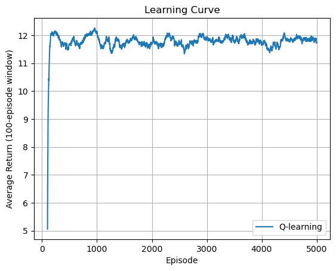
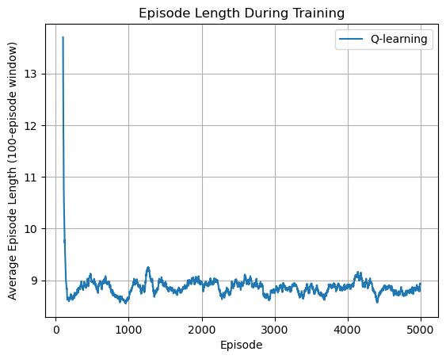
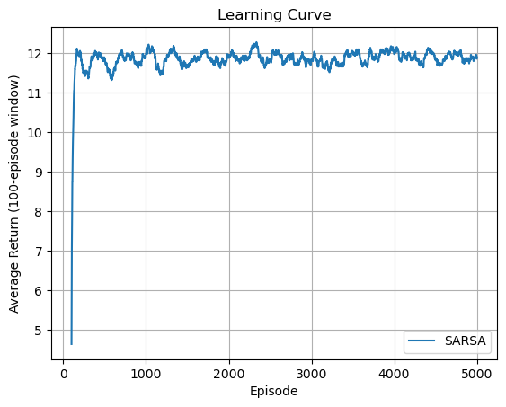
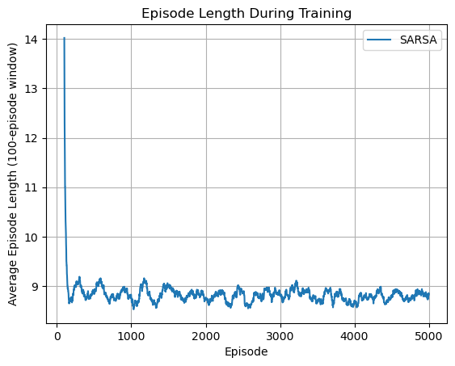
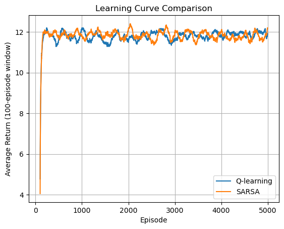
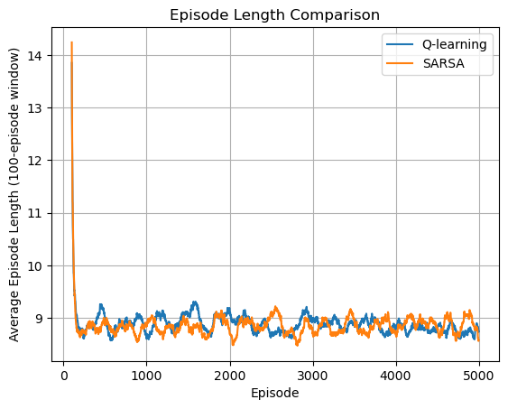

# GridWorld RL Lab

A reinforcement learning project built from scratch to implement, visualize, and compare **Q-learning** and **SARSA** in a custom GridWorld environment.

The project also includes a random-agent baseline to show how much improvement is achieved through learning.

## Environment

The environment is a deterministic **5×5 GridWorld**.

```text
S . . . .
. # # . .
. . . . .
. # . # .
. . . . G
```

- `S` — start position `(0, 0)`
- `G` — goal position `(4, 4)`
- `#` — wall

The agent has four possible actions:

| Action | Direction |
|---|---|
| `0` | Up |
| `1` | Right |
| `2` | Down |
| `3` | Left |

### Rewards

| Event | Reward |
|---|---:|
| Valid move | `-1` |
| Wall / boundary collision | `-2` |
| Reach goal | `+20` |

Each episode is limited to **100 steps**.

---

## Implemented Agents

### Random Agent

The random agent chooses an action uniformly at random and is used as a baseline.

### Q-learning

Q-learning is an **off-policy** TD control method. It updates the current state-action value using the best estimated action in the next state:

$$
Q(s,a) \leftarrow Q(s,a) +
\alpha \left[r + \gamma \max_{a'}Q(s',a') - Q(s,a)\right]
$$

### SARSA

SARSA is an **on-policy** TD control method. Instead of using the best possible next action, it updates using the action actually selected by the current policy:

$$
Q(s,a) \leftarrow Q(s,a) +
\alpha \left[r + \gamma Q(s',a') - Q(s,a)\right]
$$

Both agents use an epsilon-greedy policy during training.

---

## Project Structure

```text
rl-gridworld-lab/
├── agents/
│   ├── q_learning.py
│   ├── random_agent.py
│   └── sarsa.py
│
├── utils/
│   └── visualization.py
│
├── plots/
│   ├── individual/
│   │   ├── q_learning_return.png
│   │   ├── q_learning_episode_length.png
│   │   ├── sarsa_return.png
│   │   └── sarsa_episode_length.png
│   │
│   └── comparison/
│       ├── return_comparison.png
│       └── episode_length_comparison.png
│
├── environment.py
├── run_random_agent.py
├── train_q_learning.py
├── train_sarsa.py
├── compare_algorithms.py
└── requirements.txt
```

---

## Results

### Random Policy Baseline

Over 1000 episodes:

| Metric | Random Agent |
|---|---:|
| Success rate | 52.40% |
| Average return | -97.12 |
| Average episode length | 76.54 |

The random agent reaches the goal in roughly half of the episodes, but requires many steps and receives a strongly negative average return.

This gives a useful baseline for evaluating whether the RL agents actually learn more efficient behavior.

---

## Q-learning

Training results:

| Metric | Result |
|---|---:|
| Success rate | 100.00% |
| Average return | 11.66 |
| Average episode length | 8.95 |

After training, exploration is disabled and the greedy policy is evaluated:

```text
Greedy policy return: 13
Greedy policy length: 8
Reached goal: True
```

Learned policy:

```text
→ → → → ↓
↓ # # → ↓
→ → → → ↓
↓ # ↓ # ↓
→ → → → G
```

The greedy policy reaches the goal in **8 steps**, which is an optimal path from `(0, 0)` to `(4, 4)` in this environment.

### Q-learning Training Plots

The return curve shows how the agent's average return increases as its Q-values improve.



The episode-length curve shows the agent learning increasingly efficient paths to the goal.



---

## SARSA

Training results:

| Metric | Result |
|---|---:|
| Success rate | 100.00% |
| Average return | 11.72 |
| Average episode length | 8.92 |

Greedy evaluation:

```text
Greedy policy return: 13
Greedy policy length: 8
Reached goal: True
```

Learned policy:

```text
→ → → ↓ ↓
↓ # # ↓ ↓
→ → → → ↓
↓ # ↓ # ↓
→ → → → G
```

SARSA learns a different policy in some states, but its path from the starting state is also optimal and reaches the goal in **8 steps**.

### SARSA Training Plots





---

## Q-learning vs SARSA

A separate experiment trains both algorithms using the same hyperparameters.

| Metric | Q-learning | SARSA |
|---|---:|---:|
| Success rate | 99.98% | 99.98% |
| Average return | 11.66 | 11.69 |
| Average episode length | 8.97 | 8.94 |

Both algorithms perform very similarly in this simple deterministic environment.

### Return Comparison



The plot shows the **100-episode moving average return** during training. Both algorithms improve rapidly and then stabilize near the same level.

The training return remains below the greedy policy return of `13` because the agents continue using epsilon-greedy exploration during training. Random exploratory actions can introduce unnecessary moves or collisions.

### Episode Length Comparison



The episode-length curves show the opposite trend: as learning progresses, the number of steps required to reach the goal decreases rapidly.

Both algorithms eventually stabilize close to the optimal path length of **8 steps**.

Because exploration is stochastic and no fixed random seed is used, exact training results can vary slightly between runs.

---

## Running the Project

Install the dependencies:

```bash
pip install -r requirements.txt
```

Run the random baseline:

```bash
python run_random_agent.py
```

Train Q-learning:

```bash
python train_q_learning.py
```

Train SARSA:

```bash
python train_sarsa.py
```

Compare Q-learning and SARSA:

```bash
python compare_algorithms.py
```

---

## Key Takeaways

The project demonstrates several core reinforcement learning ideas in a small environment where the learned behavior can be inspected directly:

- tabular state-action value functions
- epsilon-greedy exploration
- temporal-difference learning
- on-policy vs off-policy learning
- Q-learning and SARSA updates
- policy extraction from a Q-table
- learning-curve visualization
- comparison against a random-policy baseline

Both Q-learning and SARSA learn an optimal greedy policy in this GridWorld and substantially outperform the random baseline.